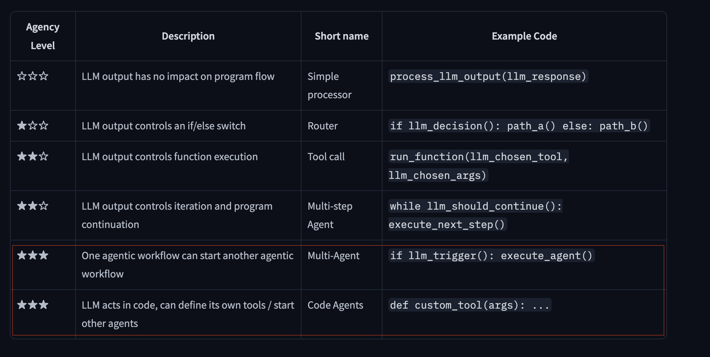
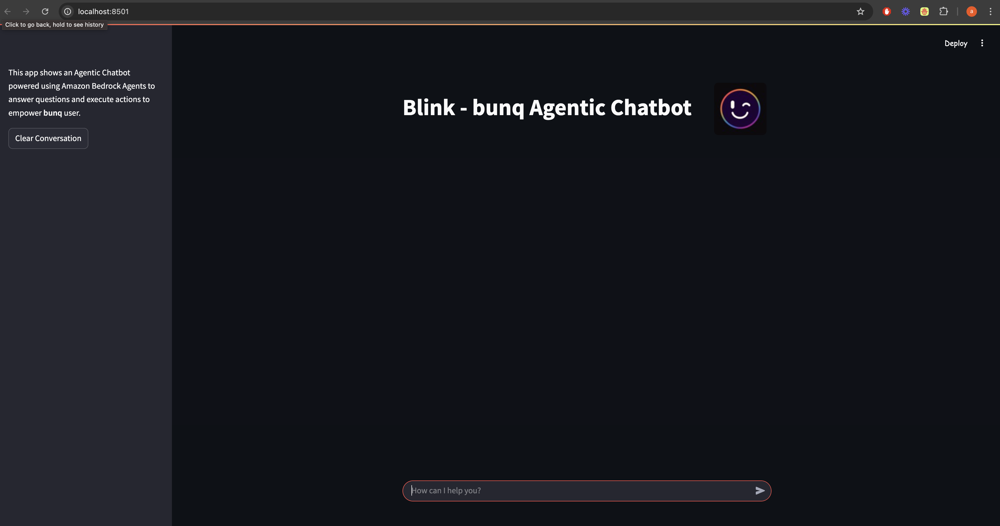
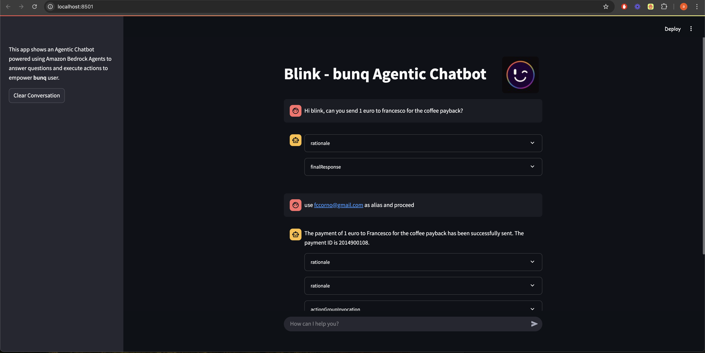
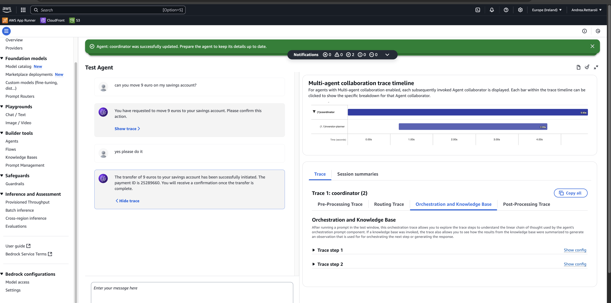
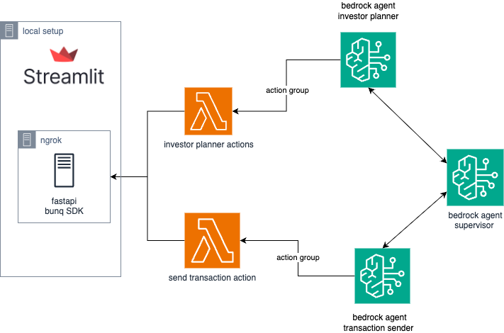
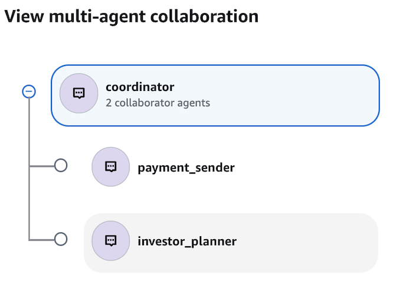

# Blink – The Conversational Banking Assistant
> **Blink.**
> Instantly send payments or move funds to savings—no UI clicks, all via natural language powered by AI-Agents.

## :rocket: Table of Contents
1. [Overview](#overview)
2. [Features](#features)
3. [Architecture](#architecture)
4. [Getting Started](#getting-started)
   - [Prerequisites](#prerequisites)
   - [Installation](#installation)
5. [Usage](#usage)
6. [Future Developments](#future-developments)


## :book: Overview

Blink is a **multi-agent-system** for conversational banking built on the bunq API. A central **Supervisor Agent** parses your natural-language commands, then delegates to specialized sub-agents: the **Transaction Facilitator** for instant payments and the **Investment Facilitator** for moving funds into your savings accounts. Each step is executed securely, seamlessly, and in the blink of an eye. To understand the complexity of this system, you can have a look at the table below, provided by Hugging Face [here](https://huggingface.co/docs/smolagents/conceptual_guides/intro_agents).




## :sparkles: Features

- **Seamless Chatbot Interface**  
  Interact with Blink via any chat platform—type your command and get immediate confirmation.

  

- **Advanced Multi-Agent Reasoning**  
  Blink isn't just a chatbot—it's a distributed **multi-agent system**. A central **Supervisor Agent** acts as a coordinator, interpreting your natural-language command and dynamically routing it to the appropriate specialist:
  - The **Transaction Facilitator** handles real-time payments.
  - The **Investment Facilitator** manages savings and fund allocation.  
  This architecture enables modular, intelligent reasoning and task delegation—making Blink highly adaptable and scalable.

- **Natural-Language Payments**  
  Send money in one sentence:  
  “Hey Blink, send €1 to Francesco for the coffee payback.”

  

- **Dynamic Savings Management**
  - **Create** new savings accounts on the fly:  
    “Hey Blink, create a savings account.”
  - **Move** funds between Main and Savings accounts instantly:  
    “Hey Blink, move €9 into my Savings account.”

    

- **Open Source & Extensible**  
  Blink is designed with **agent modularity** in mind—developers can easily add new facilitators (e.g., bill splitting, financial summaries) or swap in alternative AI agents to expand Blink’s capabilities with minimal friction.

<!-- ## :building_construction: Architecture


 -->
## :building_construction: Architecture

<p align="center">
  <br>
  <em>Figure 1: Overall architecture of the Blink system</em>
</p>

<p align="center">
  <br>
  <em>Figure 2: Multi-agent collaboration with Supervisor and Facilitators</em>
</p>


## :sparkles: Getting Started
### Prerequisites
- Python 3.10+
- AWS account

### Installation
```{bash}
git clone https://github.com/fcornetti/bunqhackathon.git 
```
```{bash}
cd bunqhackathon
```
```{bash}
python -m venv .venv
source .venv/bin/activate
```
```{bash}
pip install -r requirements.txt
```

#### Inizialize context

```
python3 initialize_bunq.py
```

### Run sdk backend
```
fastapi run main.py
```

### expose it to lambda action group via ngrok
```
ngrok http 8000
```
take the url you get and use it into the lambdas url code

### Run Streamlit UI
```
./start_ui.sh
```

Make sure you have in place look at `.env.template` files

## :crystal_ball: Future Developments

Blink is designed to scale—new **tools** and **specialized agents** can be integrated to automate complex operations and extend functionality.

Planned features include:

- **Split-Bill Agent**  
  Easily manage shared expenses:  
  _“Hey Blink, split €60 between Maria and John.”_

- **Analytics Agent**  
  Get spending insights directly in chat:  
  _“Show me my monthly restaurant spending.”_

- **Scheduling Engine**  
  Automate recurring actions like transfers and reminders.

- **Voice Interface**  
  Use Blink hands-free via Alexa or Google Assistant.

- **Mobile SDK**  
  Integrate Blink into iOS/Android apps with chat and notifications.