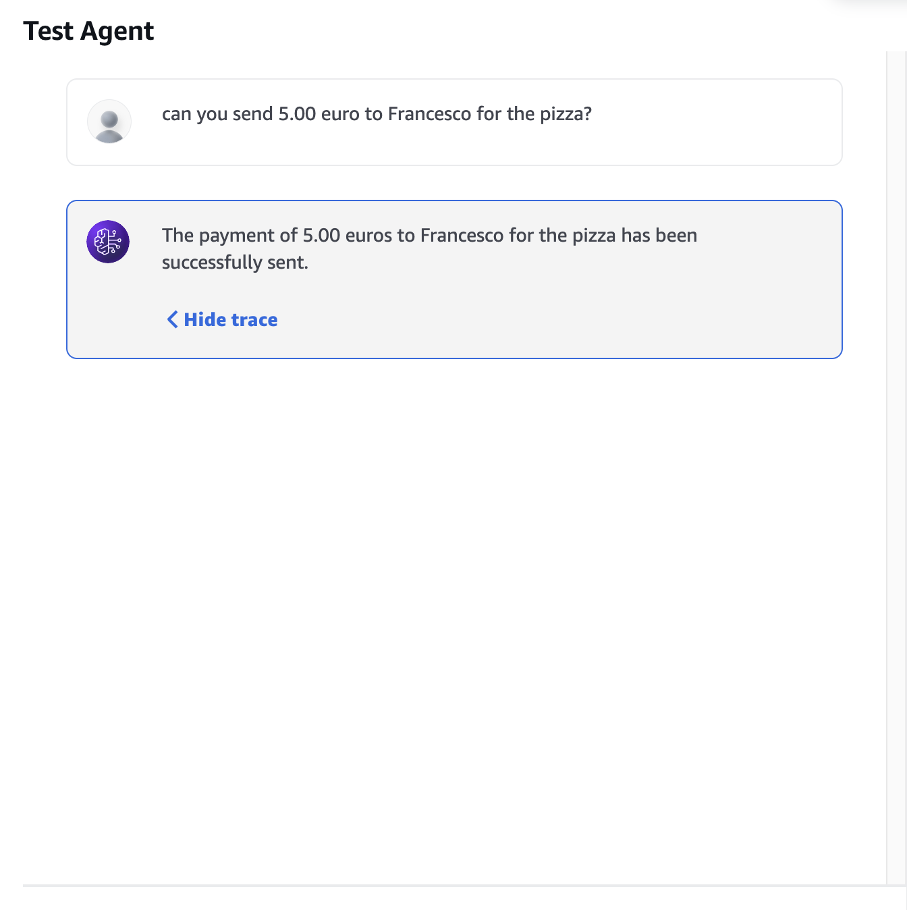
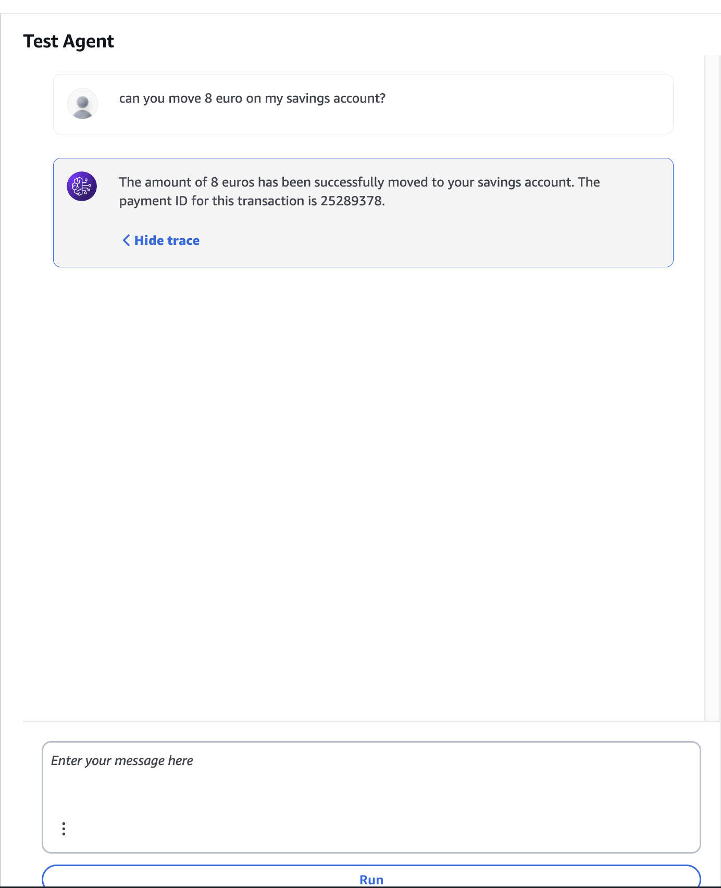

# Blink – The Conversational Banking Assistant
> **Blink. Type it. Done.**
> Instantly send payments or move funds to savings—no UI clicks, all via natural language in a chatbot interface.
---
## :rocket: Table of Contents
1. [Overview](#overview)
2. [Features](#features)
3. [Architecture](#architecture)
4. [Getting Started](#getting-started)
   - [Prerequisites](#prerequisites)
   - [Installation](#installation)
5. [Usage](#usage)
6. [Future Developments](#future-developments)
7. [Acknowledgments](#acknowledgments)
---
## :book: Overview
Blink is a **multi-agent** chatbot for conversational banking built on the bunq API. A central **Supervisor Agent** parses your natural-language commands, then delegates to specialized sub-agents: the **Transaction Facilitator** for instant payments and the **Investment Facilitator** for moving funds into your savings accounts. Each step is executed securely, seamlessly, and in the blink of an eye.
---
## :sparkles: Features
- **Seamless Chatbot Interface**
  Interact with Blink via any chat platform—type your command and get immediate confirmation.

- **Robust Multi-Agent Design**
  A Supervisor Agent routes each request to the right facilitator (Transaction Facilitator or Investment Facilitator), keeping the user experience fluid and reliable.

- **Natural-Language Payments**
  Send money in one sentence:
  “Hey Blink, send €5 to Francesco.”
  

- **Dynamic Savings Management**
  - **Create** new savings accounts on the fly:
    “Hey Blink, create a savings account.”
  - **Move** funds between Main and Savings accounts instantly:
    “Hey Blink, move €8 into my Savings account.”
    
- **Open Source & Extensible**
  Built to be easily extended—add new facilitators (e.g. split-billing, analytics) or swap in different agentic engines with minimal effort.
---
## :building_construction: Architecture


---
## :sparkles: Getting Started
# Prerequisites
- Python 3.10+
- AWS account

# Installation
```{bash}
git clone https://github.com/ai-pioneers/blink-agent.git
```
```{bash}
cd blink-agent
```
```{bash}
python -m venv venv
source venv/bin/activate
```
```{bash}
pip install -r requirements.txt
```

---
## :sparkles: Usage

---
## :: Future Developments

## :: Acknowledgments